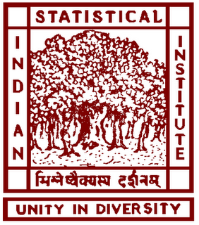
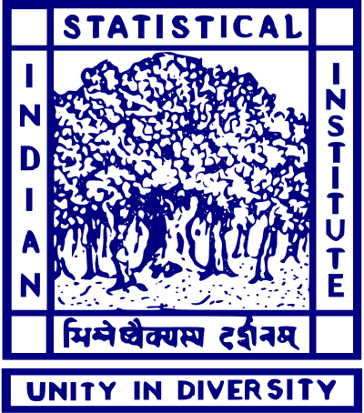

## Education
<ul style="padding-left: 0;">
  <li style="list-style: none; display: flex; align-items: flex-start; margin-bottom: 25px;">
    

      
    

    

      <b>Ph.D.</b>, <i>Biostatistics</i>, <a href="https://ph.ucla.edu/departments/biostatistics">University of California Los Angeles</a>, USA, 2025 (expected) 
      Thesis Title: <i>"Bayesian Modeling and Inference for Complex Dependent Non-Gaussian Data"</i> 
      Thesis Advisor: <a href="http://sudipto.bol.ucla.edu/">Prof. Sudipto Banerjee</a>
    

  </li>
  <li style="list-style: none; display: flex; align-items: flex-start; margin-bottom: 25px;">
    

      
    

    

      <b>M.Stat</b>, <i>Statistics</i>, <a href="https://www.isical.ac.in/">Indian Statistical Institute</a>, Kolkata, India, 2021 
      Thesis Title: <i>"Distribution-free Correlation Based Tests to Differentiate Between Related Populations"</i> 
      Thesis Advisor: <a href="https://www.isical.ac.in/~saurabh/">Prof. Saurabh Ghosh</a>
    

  </li>
  <li style="list-style: none; display: flex; align-items: flex-start; margin-bottom: 25px;">
    

      
    

    

      <b>B.Stat (Honours)</b>, <i>Statistics</i>, <a href="https://www.isical.ac.in/">Indian Statistical Institute</a>, Kolkata, India, 2019
    

  </li>
</ul>

<!-- - **Ph.D.**, *Biostatistics*, [University of California Los Angeles](https://ph.ucla.edu/departments/biostatistics), USA, 2025 (expected) 
Thesis Title: <i>"Bayesian Modeling and Inference for Complex Dependent Non-Gaussian Data"</i> 
Thesis Advisor: [Prof. Sudipto Banerjee](http://sudipto.bol.ucla.edu/)

- **M.Stat**, *Statistics*, [Indian Statistical Institute](https://www.isical.ac.in/), Kolkata, India, 2021 
Thesis Title: <i>"Distribution-free Correlation Based Tests to Differentiate Between Related Populations"</i> 
Thesis Advisor: [Prof. Saurabh Ghosh](https://www.isical.ac.in/~saurabh/)

- **B.Stat (Honours)**, *Statistics*, [Indian Statistical Institute](https://www.isical.ac.in/), Kolkata, India, 2019 -->

## Research Interests
<!-- - Bayesian hierarchical modeling and inference -->
- Integrative Bayesian learning
- Analysis of complex spatial, and spatial-temporal data
- Bayesian modeling of dynamical systems
- High-performance statistical computing
- Development of open-source statistical softwares

## Academic Awards
- Dissertation Year Award 2024-25, *UCLA Division of Graduate Education* 
USD 20,000 in fellowship & USD 19,487 in tuition grant
- Summer Mentored Research Fellowship 2022 & 2024, *UCLA* 
USD 12,000 total in fellowship over two summers
- University Fellowship 2021-22, *UCLA Graduate Division* 
USD 14,863 in fellowship
- Indian Statistical Institute stipend and yearly contingency grant, 2016-2021

## Recent Events
- 2025, Jun 2&nbsp; New preprint out on [arXiv](https://arxiv.org/abs/2505.24397).

- 2024, Oct 8&nbsp; Our new R package *spStack* is now available on [CRAN](https://cran.r-project.org/package=spStack).

<!-- * 2024, Oct 4&nbsp; The spStack [website](https://span-18.github.io/spStack-dev/) is now live! -->

- 2024, Sep 29&nbsp; Article published in [Annals of Work Exposures and Health](https://doi.org/10.1093/annweh/wxae061).

- 2024, Jun 26&nbsp; *Selected for the [UCLA Dissertation Year Award 2024-25](https://grad.ucla.edu/funding/financial-aid/funding-for-continuing-students/dissertation-year-fellowship/)* :mortar_board:

- 2024, Jun 7&nbsp; New preprint out on [arXiv](https://arxiv.org/abs/2406.04655).

- 2023, Dec 12&nbsp; Advanced to candidacy for the doctoral degree.

<!-- - *2024, Oct 8:* Our new package **spStack** is now available on [CRAN](https://cran.r-project.org/package=spStack)!
- *Oct 4, 2024:* The spStack [website](https://span-18.github.io/spStack-dev/) is now live!
- *Sep 29, 2024:* Article published in [Annals of Work Exposures and Health](https://doi.org/10.1093/annweh/wxae061).
- *Jun 26, 2024:* Selected for the [UCLA Dissertation Year Award](https://grad.ucla.edu/funding/financial-aid/funding-for-continuing-students/dissertation-year-fellowship/) :mortar_board:
- *Jun 7, 2024:* New preprint out on [arXiv](https://arxiv.org/abs/2406.04655).
- *Dec 12, 2023:* Advanced to candidacy for the doctoral degree. -->