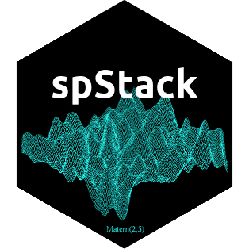

## <a href="https://span-18.github.io/spStack-dev/">spStack: Bayesian Geostatistics Using Predictive Stacking</a>
<i class="fa fa-clock-o" aria-hidden="true"></i> {{"Oct 8, 2024"}}  
Fast Bayesian inference for Gaussian and non-Gaussian geospatial models without using Markov chain Monte Carlo algorithms. This R package is written in C++ with calls to FORTRAN routines for optimized linear algebra operations. Core functions include -
- `spLMexact()`: spatial linear model with fixed values of process parameters
- `spLMstack()`: spatial linear model using Bayesian predictive stacking
- `spGLMexact()`: spatial GLM with fixed values of process parameters
- `spGLMstack()`: spatial GLM using Bayesian predictive stacking

The stable version is available on [CRAN](https://cran.r-project.org/package=spStack).&nbsp;
&nbsp;
&nbsp;
&nbsp;